# Sensata Summer Challenge - Truck Viewer

#### Andrew Hamilton, Dominik Szablonski, Thomas Dean

## How to Manually Export the Project
1. First, download Godot v3.3.2.stable.official [here](https://downloads.tuxfamily.org/godotengine/3.3.2/).
2. Open the `src/project.godot` file through the engine.
3. Click `Project/Export` and install the export templates if necessary.
4. Add the appropriate platform presets too.  
5. Ensure that `*.db, *.json` is entered into the `Filters to export non-resource files/folders` section under the `Resources` tab.
6. Click export.

## Manual
### General Overview
The program allows the user to view data based on sensors found within a truck, visualising them both through the use of graphs and through a 3D model of the truck, as well as alerting the user of any potential danger which may be a result of the truck exceeding its safety limits.

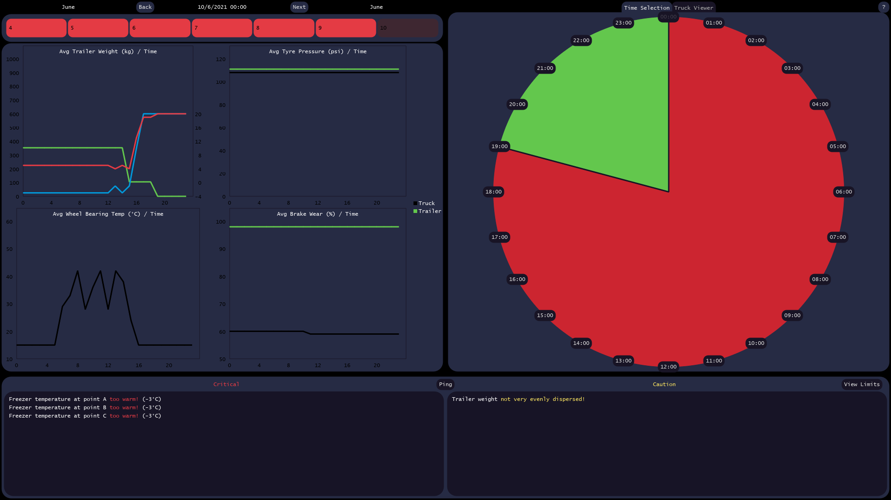

### Timeline
The timeline panel allows you to choose which date to fetch from within the database. The dates are colour coded, according to a traffic light-like system, to give the user a general sense of the truck’s status at that date. Currently, all dates are displayed red as there is no date within the data set where a sensor doesn’t exceed its critical limit. The dates outside of the range given to us are supported to be used in the future, but at the moment, they are greyed out to signify their lack of data. 

### Time Selection Clock
The clock interface works similarly, letting the user choose which hour data should be fetched for the truck. Each hour is split into segments which are then colour coded according to the traffic light system.

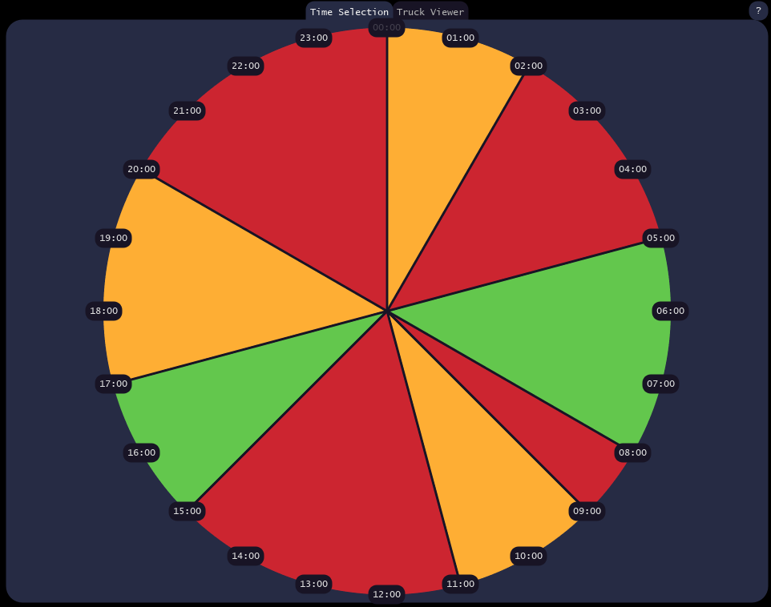

### Interactive Truck
The 4 charts shown show the average sensor values to give the user a general sense of the trends in the truck’s sensors. These can then be enlarged to give the user a more detailed view of the sensors. The graphs show multiple lines, representing multiple sensors. The points can be hovered over to show what value they represent, while the orange line signifies the current hour selected. The user can then return to the minimised view through pressing the ‘X’ button on the top right corner.

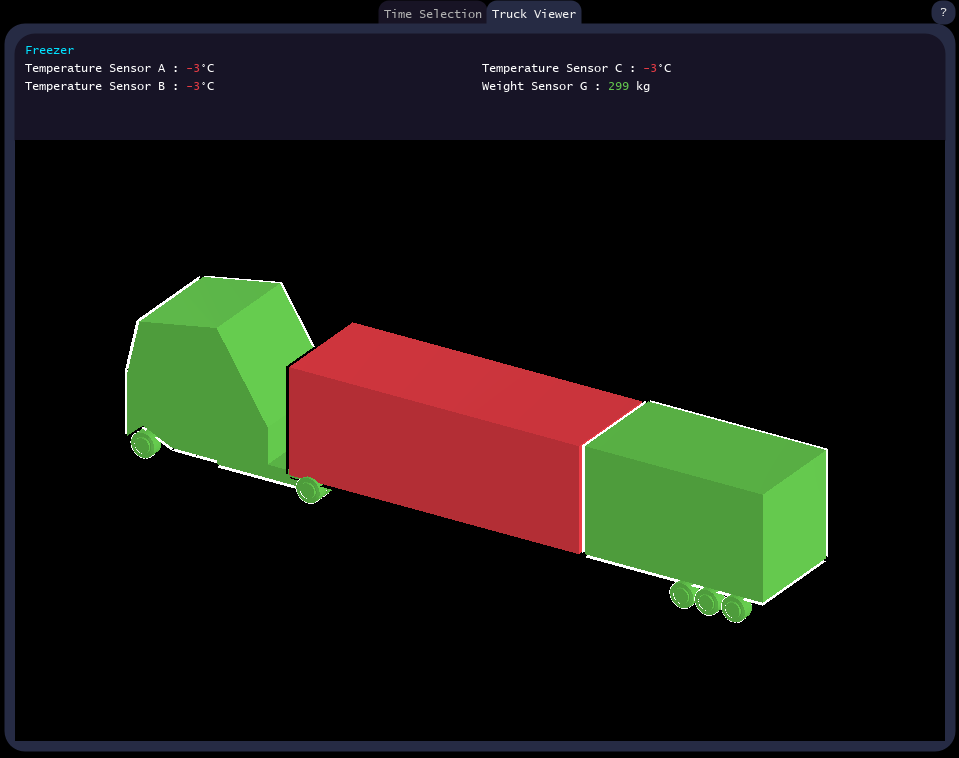

### Charts
The 4 charts shown show the average sensor values to give the user a general sense of the trends in the truck’s sensors. These can then be enlarged to give the user a more detailed view of the sensors. The graphs show multiple lines, representing multiple sensors. The points can be hovered over to show what value they represent, while the orange line signifies the current hour selected. The user can then return to the minimised view through pressing the ‘X’ button on the top right corner.

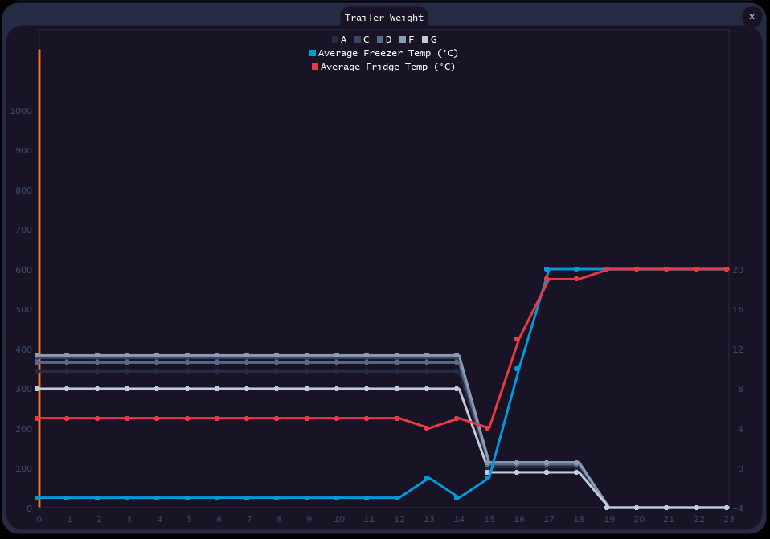

Some detailed chart views have multiple tabs which can be navigated between.

![trailer_tyre_pressure_chart_detailed)(docs/trailer_tyre_pressure_chart_detailed.png)

### Warnings
The warnings panel alerts the user of potential truck parts which are at their critical limits or close to them. The critical section displays sensors that exceed their critical limits, while the caution section displays sensors that are close to exceeding them.

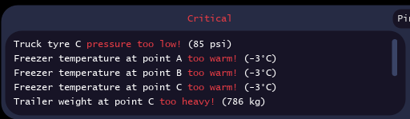

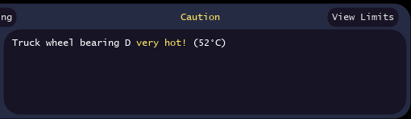

You may also view these limits by pressing the “View Limits” button in the top right corner of the panel.

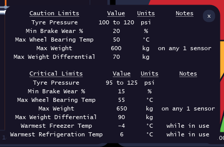

The “Ping” button between the critical and caution panels has been left unimplemented.

### Help
For further information, we have included a “help” button in the top right corner of the program, which displays a pop-up with information regarding the program’s use.

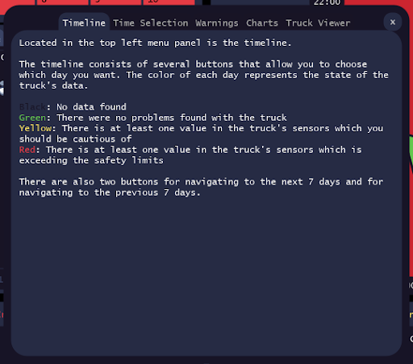

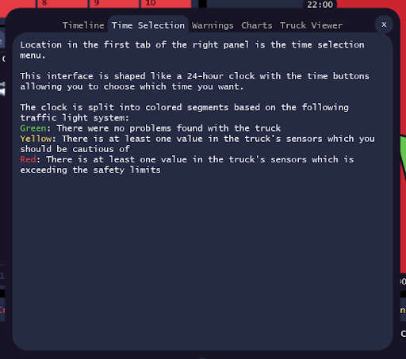

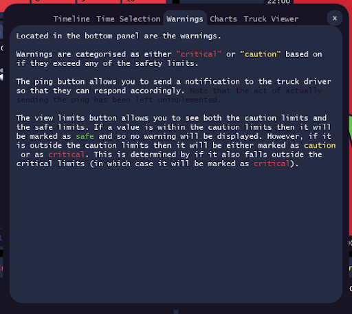

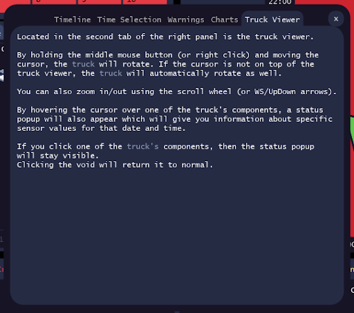
